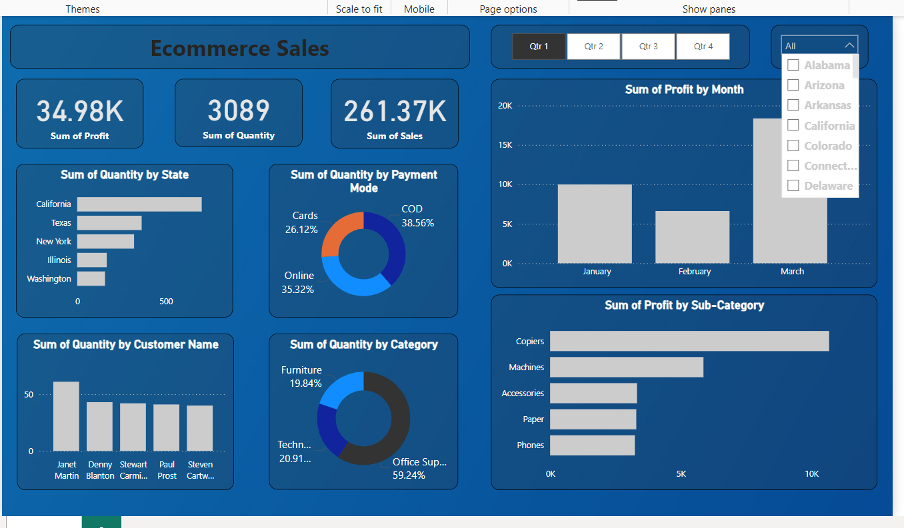

# E-commerce Sales Dashboard

This project visualizes e-commerce sales data using a comprehensive dashboard built with Power BI. The dashboard provides insights into various metrics such as total profit, total quantity sold, and sales distribution across different states, payment modes, and categories.

## Dashboard Preview



## Dashboard Features

- **Total Profit**: Displays the sum of all profits.
- **Total Quantity**: Displays the total quantity of items sold.
- **Total Sales**: Displays the sum of all sales.
- **Quantity by State**: Bar chart showing the quantity of items sold in each state.
- **Quantity by Payment Mode**: Pie chart showing the distribution of quantities sold through different payment modes (e.g., Cards, COD, Online).
- **Profit by Month**: Bar chart showing the profit for each month.
- **Quantity by Customer Name**: Bar chart showing the top customers by quantity of items purchased.
- **Quantity by Category**: Pie chart showing the distribution of quantities sold across different categories.
- **Profit by Sub-Category**: Bar chart showing the profit for each sub-category.

## Installation

1. **Download Power BI Desktop**:
    - If you haven't already, download and install Power BI Desktop from the [official website](https://powerbi.microsoft.com/desktop/).

2. **Clone the repository**:
    ```bash
    git clone https://github.com/VikashSingh0007/DashBoard_Ecommerce
    cd ecommerce-sales-dashboard
    ```

3. **Open the Power BI file**:
    - Open `ecommerce_sales_dashboard.pbix` in Power BI Desktop.

## Usage

1. **Prepare your data**:
    - Ensure your data is in a suitable format (e.g., CSV, Excel) with columns for `Profit`, `Quantity`, `Sales`, `State`, `PaymentMode`, `OrderDate`, `CustomerName`, `Category`, and `SubCategory`.

2. **Load your data**:
    - In Power BI Desktop, go to `Home > Transform Data` to load your data into the report.

3. **Refresh data**:
    - After loading your data, refresh the data model to ensure all visualizations are updated with the latest data.

## Example Data Format

Your CSV or Excel file should be structured like this:

```csv
Profit,Quantity,Sales,State,PaymentMode,OrderDate,CustomerName,Category,SubCategory
500,2,1000,California,Cards,2024-01-01,Janet Martin,Furniture,Copiers
300,1,300,Texas,COD,2024-01-02,Denny Blanton,Technology,Phones
...
